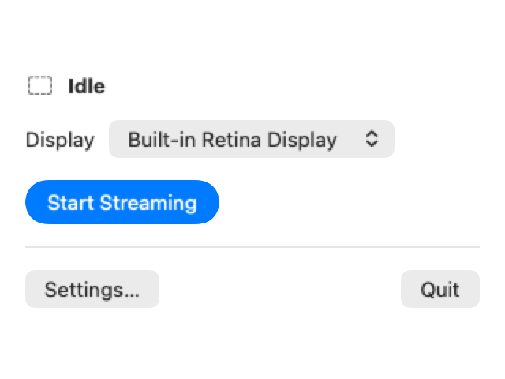
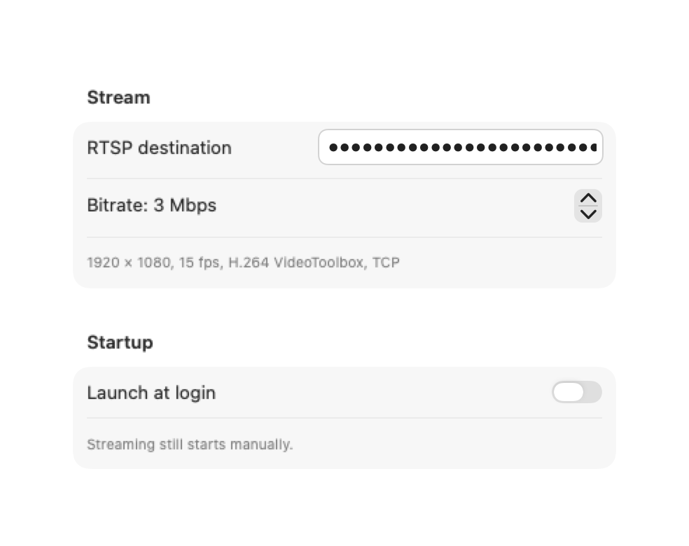

# AI Screen Stream

中文 · [English](#english)


[开源协议](LICENSE) · [开始安装](docs/INSTALL.md)

**看电视的时候，也能看一眼 Mac 上的 AI 任务跑到哪了。**

让 AI 在 Mac 上写代码、跑任务，自己去看电视。想知道它还在执行、已经完成，还是停在某一步等你操作时，在 Apple TV 的家庭摄像头入口打开电脑画面，就能直接看到原来的 AI 窗口。

AI Screen Stream 是一个原生 macOS 菜单栏工具：把选中的屏幕作为视频源，通过局域网里的 Linux 主机接入 Apple「家庭」。Apple TV、iPhone 和 Mac 都可以查看。

它共享的是屏幕画面，**不自动识别 AI 状态、不发送完成通知，也不能远程点击电脑**。任务进行到了哪里，由你看画面判断；不需要接入 AI 工具的 API。

## 使用场景

1. 在 Mac 上开始 AI 任务，把任务窗口放在准备共享的显示器上。
2. 在菜单栏选择这块显示器，点击 **Start Streaming**。
3. 看电视期间，需要了解任务进度时，在 Apple TV 打开对应的家庭摄像头。
4. 看到任务结束或需要接手，再回到电脑。用完后点 **Stop Streaming**。

这里不承诺自动弹窗、状态叠加或持续画中画；电视端如何打开摄像头取决于 Apple TV 的系统界面。

## 界面

菜单栏：选择屏幕，开始或停止共享。



设置：推流地址、码率与登录启动。



以上图片由真实 SwiftUI 组件在本机渲染，使用示例配置；不是实时投屏或 Apple TV 实拍。

## 工作方式

`Mac 屏幕 → MediaMTX → Scrypted → Apple 家庭 / Apple TV`

Mac 负责采集和编码，Linux 上的 MediaMTX 接收并转发，Scrypted 将它作为独立 HomeKit 摄像头接入家庭。某些客户端需要启用 Scrypted 兼容性转码，会增加 Linux 主机 CPU 占用。

Mac 端默认输出 **1920×1080、15 fps、H.264、约 3 Mbps、无音频**。菜单栏选屏，手动开始和停止；支持切屏、断线重试和登录启动。登录启动不会自动投屏。

本项目名称中的 AI 不代表 AI 识别功能。没有 OCR、录像、云端上传或远程控制功能。家庭成员能看到整块被选中的屏幕，包括通知和私人窗口。

## 项目状态

这是从个人实际部署整理出的源码项目。2026 年 8 月的使用反馈确认过 Mac、Apple TV、iPhone 和远程观看可用；iPhone 的一次故障通过关闭手机代理恢复。这里没有发布两小时稳定性、跨路由器兼容性或自动迁移的保证。

发布目录保留现有 Mac 源码，重新提供便携的 Linux Compose 配置。**新的 Compose 部署尚未在全新服务器上端到端验证**；源码构建与配置生成检查见 [验证记录](docs/VERIFICATION.md)。不要直接覆盖已有的 MediaMTX/Scrypted 部署。

## 快速开始

需要 Apple Silicon Mac（macOS 13+、Xcode Command Line Tools、FFmpeg），以及同局域网的 Linux 主机（Python 3、Docker Engine 和 Compose 插件）。Surface 不是必需；服务器采用 Linux host networking。Intel Mac 暂未提供构建目标。

**1. 在 Linux 上准备服务**

下载/克隆本仓库并进入仓库根目录，把下面主机名换成 Linux 主机真实的局域网 IP 或可解析名称：

```sh
python3 scripts/setup-server.py --host screen-server.local
cd server
sudo docker compose up -d
```

随机凭据及推流、读流地址写在 `server/private/connection.txt`。重复生成保留原凭据。文件不会自动提交到 Git。

**2. 在 Mac 上构建**

在 Mac 的仓库根目录执行；以下假设已安装 Homebrew：

```sh
xcode-select --install  # 已安装 Command Line Tools 可跳过
brew install ffmpeg
zsh macOS/scripts/self-check.sh
zsh macOS/scripts/build.sh
```

把 `dist/AI Screen Stream.app` 放进固定的 Applications 目录后打开。在菜单栏 **Settings… → RTSP destination** 填入上一步的 Mac publish URL，然后选屏、点 **Start Streaming**，按系统提示授予屏幕录制权限。

发布构建不会嵌入你的 RTSP 凭据。默认依赖本机 Homebrew FFmpeg；这份源码包不附带 FFmpeg 二进制。

**3. 接入家庭**

打开 `https://screen-server.local:10443`，确认访问的是自己的 Linux 主机后，完成 Scrypted 的初始账号设置。安装 RTSP Camera 与 HomeKit 插件，创建 RTSP 摄像头，填入 Camera read URL，确认预览，再以独立配件配对 Apple 家庭。完整步骤见 [接入与使用](docs/SETUP.md)。

首次账号设置、macOS 系统录屏授权、Apple 家庭配对需要本人完成。项目不自动操作 Apple ID，也不迁移其他家庭的配对数据库。

## Home Assistant 与 Scrypted 的关系

**Scrypted 独立于 Home Assistant 运行。** Apple 家庭的视频路径不依赖 HA；HA 只是可选的另一位 RTSP 观看者。HACS 是 HA 的社区集成入口，与这条推流链路无关。

旧版本曾通过 HA HomeKit 导出摄像头；这份项目采用最终使用的 Scrypted 路径。迁移时不要再同时导出同一块屏幕，否则家庭中会出现两个容易混淆的配件。

## 文档

- [接入、日常操作与远程观看](docs/SETUP.md)
- [维护、版本、更新和 GitHub 上传](docs/OPERATIONS.md)
- [转圈、静帧、VPN 与权限排查](docs/TROUBLESHOOTING.md)
- [验证范围](docs/VERIFICATION.md)
- [安全与第三方组件](SECURITY.md)、[第三方说明](THIRD_PARTY_NOTICES.md)

## 开源声明

本仓库原创代码、脚本和文档以 [MIT License](LICENSE) 发布，允许使用、修改和分发，需保留版权及许可声明。软件按现状提供，不附带担保。

FFmpeg、MediaMTX、Scrypted 和可选的 Home Assistant 各自遵循其上游许可；源码包不包含这些组件的二进制。详见 [第三方组件说明](THIRD_PARTY_NOTICES.md)。

本项目为个人独立项目，与 Apple 无隶属或赞助关系，未获 Apple 官方认证。Apple Home、HomeKit、macOS 等名称归各自权利人所有。

MIT 协议另附[中文参考译文](LICENSE.zh-CN.md)，以英文原文为准。

---

## English

**Check on your Mac's AI tasks while watching TV.**

Let an AI tool write code or run a task on your Mac while you watch TV. When you want to see whether it is still working, has finished, or needs your input, open the corresponding Home camera on Apple TV to see the original AI window.

AI Screen Stream is a native macOS menu-bar utility. It sends a selected display through a Linux server on your local network and exposes it as a camera in Apple Home, viewable from Apple TV, iPhone, and Mac.

It shares pixels: **there is no automatic task-state detection, completion notification, or remote control.** You read the progress from the screen yourself. No integration with an AI tool's API is required.

### Typical use

1. Start an AI task on your Mac and place its window on the display you want to share.
2. Select that display in the menu bar and click **Start Streaming**.
3. While watching TV, open the matching Home camera on Apple TV whenever you want to check progress.
4. Return to your Mac when the task is finished or needs input. Click **Stop Streaming** when done.

Automatic pop-ups, status overlays, and persistent picture-in-picture are not promised. Camera access on the TV depends on the Apple TV system interface.

### Interface

The menu contains display selection and stream controls. Settings contain the RTSP destination, bitrate, and launch-at-login option.


These images are local renders of the actual SwiftUI components with example settings, not live-stream captures or photographs of Apple TV. Launch at login opens the app; it does not automatically start sharing.

### How it works

`Mac display → MediaMTX → Scrypted → Apple Home / Apple TV`

The Mac captures and encodes the display. MediaMTX on Linux receives and forwards the stream; Scrypted exposes it as an independent HomeKit camera accessory. Some clients may need compatibility transcoding in Scrypted, which increases Linux CPU usage.

Defaults: **1920×1080, 15 fps, H.264 VideoToolbox hardware encoding, approximately 3 Mbps, no audio, RTSP over TCP**. The app supports display switching, connection retries, and optional launch at login. There is no OCR, AI detection, recording, cloud-upload feature, or remote control. Sharing a display also exposes notifications and private windows on it.

### Project status

This repository was prepared from a personal deployment. In August 2026, the user reported working playback on Mac, Apple TV, iPhone, and remotely. One iPhone problem was resolved by disabling its proxy. This does not establish two-hour stability or compatibility across routers and operating systems.

The Mac sources are retained, while the Linux setup is repackaged as portable Compose configuration. **The new Compose setup has not been tested end to end on a fresh server.** See [verification boundaries](docs/VERIFICATION.md). Do not overwrite an existing MediaMTX/Scrypted deployment without checking its configuration and data.

### Quick start

Requirements: an Apple Silicon Mac with macOS 13+, Xcode Command Line Tools and FFmpeg; a Linux host on the same LAN with Python 3, Docker Engine and the Compose plugin. A Surface is optional. The server uses Linux host networking. An Intel Mac build target is not currently provided.

On Linux, run from the repository root and replace the example hostname with the server's actual LAN address:

```sh
python3 scripts/setup-server.py --host screen-server.local
cd server
sudo docker compose up -d
```

Random publish/read credentials and URLs are saved in `server/private/connection.txt`. Re-running setup preserves credentials. Never upload this file.

On the Mac, with Homebrew installed, run from the repository root:

```sh
xcode-select --install  # Skip if Command Line Tools are already installed.
brew install ffmpeg
zsh macOS/scripts/self-check.sh
zsh macOS/scripts/build.sh
```

Move `dist/AI Screen Stream.app` into a consistent Applications location and open it. In **Settings… → RTSP destination**, enter the generated Mac publish URL, select a display and start streaming. Grant Screen Recording access when prompted. Public builds do not embed private destination credentials and use a locally installed FFmpeg; this source package does not bundle its binary.

Visit `https://<server-address>:10443` on your own server to complete Scrypted onboarding. Install the RTSP Camera and HomeKit plugins, create a camera using the generated read URL, confirm the preview and pair it with Apple Home in Accessory Mode. Account setup, macOS permission and Home pairing require your participation. This project does not operate your Apple ID or migrate another home's pairing database.

Full instructions: [installation](docs/INSTALL.md) · [Home setup and daily use](docs/SETUP.md).

### Home Assistant is optional

**Scrypted runs independently of Home Assistant.** HA can read the same RTSP stream as an additional viewer; it is not required by the Apple Home video path. HACS is an HA community integration entry point, unrelated to this streaming path.

An earlier deployment exported the camera through HA HomeKit. This repository follows the final Scrypted setup. Avoid exporting the same screen twice, which creates confusing duplicate accessories in Home.

### Documentation

- [Home setup, daily use and remote viewing](docs/SETUP.md)
- [Maintenance, updates and GitHub upload](docs/OPERATIONS.md)
- [Frozen frames, VPN issues and permission troubleshooting](docs/TROUBLESHOOTING.md)
- [Verification boundaries](docs/VERIFICATION.md)
- [Security and privacy](SECURITY.md) · [Image provenance](docs/ASSETS.md)

### Open-source notice

Original code, scripts and documentation are released under the [MIT License](LICENSE). You may use, modify and distribute them while retaining the copyright and license notice. The software is provided as is, without warranty.

FFmpeg, MediaMTX, Scrypted and optional Home Assistant components retain their respective upstream licenses. Their binaries are not included in this source archive. See [third-party notices](THIRD_PARTY_NOTICES.md).

This is an independent personal project, not affiliated with, sponsored by, or certified by Apple. Apple Home, HomeKit, macOS and other product names belong to their respective owners. A [Chinese reference translation](LICENSE.zh-CN.md) accompanies the authoritative English MIT license.
